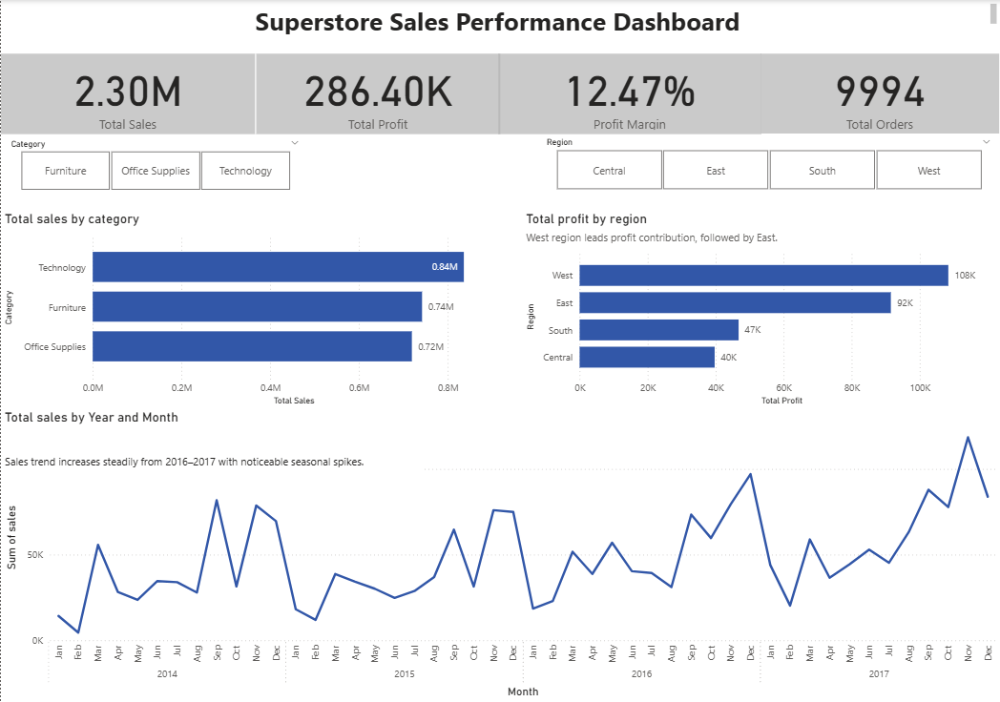

# Retail Sales & Profitability Analysis Dashboard

This project analyzes a retail dataset to identify key drivers of sales, customer behavior, and profitability. The goal is to uncover patterns that can support better business decisions around pricing, product strategy, and regional performance.

---

## Tools & Technologies
- **MySQL** — Data cleaning, transformation, and validation  
- **Power BI** — Interactive dashboard development  
- **DAX** — Calculated measures and KPIs  

---

## Dashboard Overview

### 🔹 Sales Overview
- KPIs: Total Sales, Total Profit, Profit Margin, Number of Orders  
- Monthly sales trend highlighting seasonality  
- Sales distribution by category and region  

### 🔹 Customer & Product Analysis
- Sales contribution by customer segment  
- Top 10 products by revenue and profitability  
- Sub-category performance comparison  
- Ship mode-based filtering  

### 🔹 Profitability Analysis
- Discount vs Profit relationship (scatter plot)  
- Profit margin by sub-category  
- Identification of loss-making products and categories  

---

## Key Business Insights

- **Higher discounts are strongly associated with lower profitability**, indicating potential over-discounting strategies  
- **Several high-revenue products generate low or negative profit**, highlighting inefficiencies in pricing or cost structure  
- **The West region contributes the highest profit**, while the Central region consistently underperforms  
- **Profit margins vary significantly across sub-categories**, suggesting opportunities for optimization in product mix  
- **Consumer segment drives the majority of sales**, making it a key target for marketing and retention strategies  

---

## Dashboard Screenshots

### Sales Overview

###  Customer & Product Analysis

### Profitability Analysis

---

##  Project Outcome

This project demonstrates the ability to:
- Build an end-to-end data workflow from raw data to insights  
- Clean and transform data using SQL for analysis-ready datasets  
- Design interactive dashboards to communicate insights effectively  
- Translate data into actionable business recommendations  

---

## Business Recommendations

- Reduce excessive discounting, as higher discounts are linked to lower profitability  
- Focus on strong-performing sub-categories like Phones and Chairs  
- Investigate products that generate high sales but low or negative profit  
- Improve performance in weaker regions such as Central  
- Target the Consumer segment for growth opportunities  

## How to Use
1. Run SQL scripts in order (01 → 04)
2. Load cleaned data into Power BI
3. Open .pbix file
